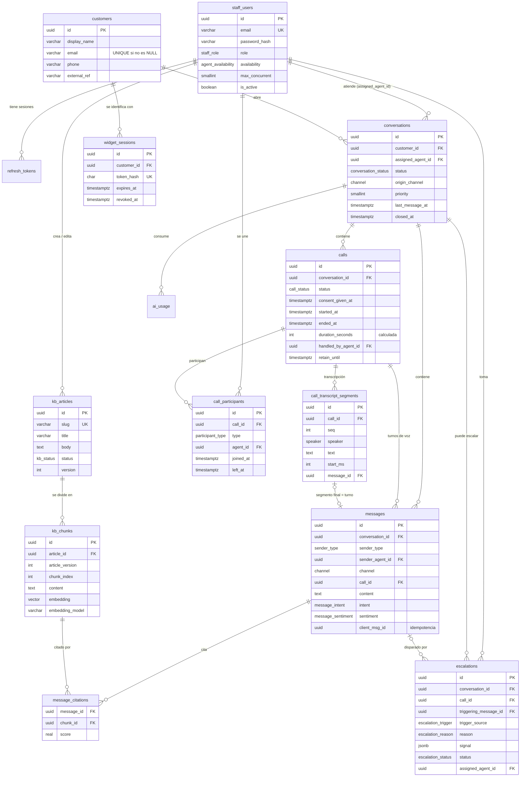

# Modelo de dominio: Atención al cliente omnicanal con IA

Este documento se escribe **antes** que cualquier migración. Define las entidades, sus
relaciones, las reglas de negocio que el esquema debe hacer cumplir por sí mismo (no solo
el backend) y el orden en que se van a crear las migraciones de la Fase 1.

## 1. Vocabulario

| Término | Significado |
|---|---|
| **Staff** | Personas de la empresa que usan el panel: **agentes** (atienden) y **administradores** (gestionan la base de conocimiento, ven todo). Tienen cuenta con contraseña. |
| **Cliente** (`customer`) | Quien escribe o llama. **No** tiene contraseña: se identifica con un token de sesión del widget. |
| **Conversación** | Un hilo de atención de un cliente. Puede tener mensajes de texto, una o varias llamadas, o ambos (mixta). |
| **Turno / mensaje** | Una intervención de alguien (cliente, IA, agente o sistema). Un fragmento de voz transcrito **también** es un mensaje: el motor conversacional no distingue el canal. |
| **Llamada** | Sesión de voz WebRTC dentro de una conversación, con sus metadatos y su transcripción. |
| **Escalamiento** | El momento en que una conversación pasa de la IA a un humano, con la señal que lo disparó. |
| **Base de conocimiento (KB)** | Artículos/FAQs de la empresa. Son la **única** fuente del RAG. |

## 2. Diagrama



Tablas transversales (no dibujadas para no saturar el diagrama): `login_attempts`,
`audit_log`, `ai_usage` y `schema_migrations`.

## 3. Entidades

### 3.1 Identidad y acceso

**`staff_users`**: agentes y administradores. Un solo tipo de tabla con `role`
(`admin` | `agent`), igual que en el Proyecto 1: un admin también puede atender.
- `email` único y **siempre en minúsculas** (CHECK `email = lower(email)`), así el UNIQUE
  no se burla con mayúsculas.
- `availability` (`offline` | `available` | `busy` | `away`) y `max_concurrent`
  (conversaciones simultáneas que acepta, 1–20): el motor de escalamiento los usa para
  escoger a quién notificar. La presencia en tiempo real (conectado/desconectado) vive en
  **Redis**; esta columna es el estado que el agente elige.
- `is_active`: desactivar en vez de borrar (las conversaciones pasadas lo referencian).

**`refresh_tokens`**: mismo diseño que funcionó en el Proyecto 1. Solo el SHA-256 del
token, `family_id` para la rotación, `replaced_by`, `revoke_reason`
(`rotated` | `logout` | `reuse_detected` | `expired`). Si llega un token ya rotado se
revoca la familia completa.

**`login_attempts`**: fallos por cuenta (clave = SHA-256 del correo normalizado, exista o
no la cuenta, para no revelar cuáles existen), `failures`, `locked_until`. El bloqueo por
IP lo hace el rate limiter en Redis.

**Roles**: el enum `staff_role` basta para esta materia. Los permisos concretos
(`kb:write`, `conversation:read:any`…) se mapean en código a partir del rol, para poder
añadir un rol `supervisor` más adelante sin tocar las tablas de negocio.

### 3.2 Clientes finales

**`customers`**: quien escribe o llama. Todos los datos de contacto son **opcionales**
(un cliente anónimo es válido). `email` es único solo cuando existe (índice único
parcial) y en minúsculas. `external_ref` sirve para enlazarlo con el CRM de la empresa.

**`widget_sessions`**: cómo se identifica un cliente sin contraseña. El widget recibe un
token opaco aleatorio; en la base solo se guarda su SHA-256 (`token_hash`), con
`expires_at` y `revoked_at`. Un cliente puede tener varias sesiones (varios dispositivos).

> **Puerta abierta a cuentas de cliente:** el día que los clientes tengan contraseña se
> crea una tabla `customer_credentials (customer_id PK/FK, password_hash, …)` y su propia
> tabla de refresh tokens. `customers` y todo lo que cuelga de ella (conversaciones,
> llamadas) no cambian, porque nunca dependieron de cómo se autentica el cliente.

### 3.3 Conversaciones y mensajes

**`conversations`**
- `status`: máquina de estados

  ```
  ai_active ──(escalamiento)──▶ waiting_agent ──(agente la toma)──▶ agent_active
      │                              │                                   │
      └──────────────────────────────┴──────────────(cierre)─────────────┴──▶ closed
  ```
- `origin_channel` (`text` | `voice`): por dónde empezó. Que sea "mixta" se deduce de sus
  mensajes/llamadas, no se guarda (evita un dato que se desincroniza).
- `assigned_agent_id`: NULL mientras está con la IA o en la cola.
  CHECK: `status = 'agent_active'` ⇒ `assigned_agent_id IS NOT NULL`.
- `priority` (0–100): la sube el escalamiento (fraude > cliente molesto > reclamo…). La
  cola del agente se ordena por `priority DESC, last_message_at ASC`.
- `last_message_at`: desnormalizado para ordenar listas sin agregar sobre `messages`.
- `closed_at` + `close_reason`. CHECK: `status = 'closed'` ⇔ `closed_at IS NOT NULL`.

**`messages`**: un turno.
- `sender_type` (`customer` | `ai` | `agent` | `system`). CHECK: `sender_agent_id` está
  presente **si y solo si** `sender_type = 'agent'`.
- `channel` (`text` | `voice`) y `call_id`. CHECK: `channel = 'voice'` ⇔ `call_id IS NOT
  NULL`. Así la voz transcrita es un mensaje más y el motor conversacional es uno solo.
- `intent` (`general_inquiry` | `complaint` | `possible_fraud` | `account_access` |
  `human_request` | `other`), `sentiment` (`positive` | `neutral` | `negative` |
  `angry`) y `analysis_confidence` (0–1): análisis por turno **guardado junto al
  mensaje**, como pide el enunciado. Solo se llenan para mensajes del cliente.
- `client_msg_id`: UUID que genera el frontend. UNIQUE `(conversation_id,
  client_msg_id)`: si el WebSocket se reconecta y reenvía, el mensaje no se duplica.
- `ai_model`, `ai_latency_ms`: para los mensajes de la IA (observabilidad y reporte de
  carga).

**`message_citations`**: qué fragmentos de la KB usó la IA para responder
(`message_id`, `chunk_id`, `score`). Permite al agente ver "de dónde sacó eso" la IA y
auditar el RAG.

### 3.4 Llamadas (voz WebRTC)

**`calls`**
- `status`: `connecting` → `in_progress` ⇄ `waiting_agent` → `ended` | `failed`.
- `consent_given_at` **NOT NULL**: no puede existir una llamada sin consentimiento
  registrado. `consent_version` indica qué texto de aviso aceptó.
- `started_at`, `answered_at`, `ended_at`; `duration_seconds` es una **columna
  calculada** (`GENERATED ALWAYS AS … STORED`) a partir de `answered_at`/`ended_at`, para
  que nunca contradiga las marcas de tiempo.
- `handled_by_agent_id`: el agente humano que la atendió (NULL = solo la IA).
- `end_reason` (`customer_hangup` | `agent_hangup` | `timeout` | `error` | `transferred`).
- `stt_provider` / `tts_provider`: qué proveedor se usó (`mock` en desarrollo).
- Retención: `retain_until` (fecha a partir de la cual se purga la transcripción) y
  `audio_storage_key` (NULL por defecto: **el audio no se guarda** salvo que la política
  lo pida). La política se documenta en la Fase 5 (`docs/privacy-voice.md`).

**`call_participants`**: quién estuvo en la llamada y cuándo (`customer`, `ai`,
`agent` + `agent_id`, `joined_at`, `left_at`). Es lo que registra que un agente "se unió"
a una llamada en curso.

**`call_transcript_segments`**: la transcripción completa, en orden (`seq`), con
`speaker` (`customer` | `ai` | `agent`), `text`, tiempos (`start_ms`, `end_ms`) y
`message_id`: cada segmento **final** se convierte en un turno (`messages`) y queda
enlazado. UNIQUE `(call_id, seq)`. Los resultados parciales del STT en streaming **no**
se guardan (solo viajan por WebSocket).

### 3.5 Escalamiento

**`escalations`**
- `trigger_source` (`rule` | `ai_signal` | `customer_request` | `agent_manual`) y
  `reason` (`possible_fraud` | `angry_customer` | `complaint` | `low_confidence` |
  `human_requested` | `repeated_failure` | `voice_call`).
- `signal` (JSONB): la evidencia concreta (regla aplicada, puntajes de intención y
  sentimiento, número de turnos sin resolver…). Se guarda para poder auditar por qué se
  escaló.
- `triggering_message_id`, `call_id` (si ocurrió durante una llamada).
- `status`: `open` → `assigned` → `resolved` | `cancelled`, con `assigned_agent_id`,
  `assigned_at`, `resolved_at`.
- **Sin duplicados abiertos**: índice único parcial
  `UNIQUE (conversation_id) WHERE status IN ('open', 'assigned')`. Dos turnos que llegan
  a la vez y ambos deciden escalar: uno inserta y el otro recibe un conflicto que el
  backend trata como "ya estaba escalada" (`INSERT … ON CONFLICT DO NOTHING`). La
  garantía la da la base, no un `SELECT` previo con carrera.

### 3.6 Base de conocimiento y RAG

**`kb_articles`**: `slug` único, `title`, `body`, `category`, `tags TEXT[]`, `status`
(`draft` | `published` | `archived`), `version` (sube en cada edición del contenido),
`created_by` / `updated_by`, `published_at`.

**`kb_chunks`**: fragmentos del artículo con su embedding (`vector(1024)`),
`embedding_model`, `article_version`, `chunk_index`, `content_sha256`.
- UNIQUE `(article_id, chunk_index, embedding_model)`: re-indexar un artículo reemplaza
  sus fragmentos, nunca los duplica.
- Índice HNSW (`vector_cosine_ops`) para la búsqueda semántica.
- Dimensión 1024: la del proveedor recomendado para embeddings; el proveedor `mock`
  genera vectores deterministas de la misma dimensión. Cambiar de dimensión = migración
  nueva + re-indexar.

**Aislamiento del RAG (decisión de diseño):** en `kb_chunks` **solo** hay contenido de la
base de conocimiento. Los mensajes de los clientes **nunca** se convierten en embeddings
ni se escriben en esa tabla, así que es imposible que el texto de un cliente aparezca
como "contexto" en la respuesta a otro cliente. La búsqueda filtra además por artículos
`published`. El historial de la conversación entra al prompt solo desde la propia
conversación y siempre marcado como datos no confiables.

### 3.7 Transversales

**`audit_log`**: quién hizo qué, sobre qué y cuándo. `actor_type` (`staff` | `customer`
| `system`), `actor_id`, `action` (`auth.login`, `conversation.take`, `kb.update`,
`call.join`…), `entity_type`, `entity_id`, `metadata JSONB` (nunca contraseñas, tokens ni
contenido de mensajes), `ip_hash`, `created_at`.

**`ai_usage`**: cada llamada a un proveedor de pago (`chat`, `embedding`, `stt`, `tts`)
con unidades consumidas (tokens, segundos de audio, caracteres) por conversación y
cliente. Sirve para topes de gasto por cliente (defensa contra "agotar créditos de IA por
el canal de voz") y para el reporte de costos.

**`schema_migrations`**: la gestionan los scripts `migrate`, desde la primera ejecución.

## 4. Reglas que hace cumplir la base (no solo el backend)

| Regla | Mecanismo |
|---|---|
| Un solo escalamiento abierto por conversación | Índice único parcial en `escalations` |
| Un mensaje reenviado no se duplica | UNIQUE `(conversation_id, client_msg_id)` |
| Solo los mensajes de agente tienen agente | CHECK en `messages` |
| Un turno de voz siempre pertenece a una llamada | CHECK `channel`/`call_id` |
| No hay llamada sin consentimiento | `consent_given_at NOT NULL` |
| La duración no contradice los tiempos | Columna calculada |
| Conversación atendida ⇒ tiene agente; cerrada ⇒ tiene fecha de cierre | CHECK en `conversations` |
| No se duplican embeddings de un artículo | UNIQUE en `kb_chunks` |
| Correos únicos sin trampa de mayúsculas | CHECK `lower()` + UNIQUE |
| Tokens guardados solo como hash | CHECK `^[0-9a-f]{64}$` |
| `updated_at` siempre correcto | Trigger `set_updated_at()` |

## 5. Consultas previsibles → índices

| Consulta | Índice |
|---|---|
| Cola general: sin agente, en espera, por prioridad | `conversations (priority DESC, last_message_at) WHERE status = 'waiting_agent'` |
| "Mis conversaciones" de un agente, recientes primero | `conversations (assigned_agent_id, status, last_message_at DESC)` |
| Historial de un cliente | `conversations (customer_id, created_at DESC)` |
| Mensajes de una conversación en orden | `messages (conversation_id, created_at)` |
| Transcripción de una llamada | UNIQUE `call_transcript_segments (call_id, seq)` |
| Llamadas de una conversación | `calls (conversation_id, started_at DESC)` |
| Llamadas en curso | `calls (status) WHERE status IN ('connecting','in_progress','waiting_agent')` |
| Escalamientos abiertos para la bandeja | `escalations (status, created_at) WHERE status IN ('open','assigned')` |
| Búsqueda semántica | HNSW `kb_chunks (embedding vector_cosine_ops)` |
| Purga por retención | `calls (retain_until)` |
| Consumo de IA de un cliente en una ventana | `ai_usage (customer_id, created_at)` |
| Todas las FK | Un índice por cada FK que no esté ya cubierta por otro índice compuesto |

## 6. Plan de migraciones (Fase 1)

| Archivo | Contenido |
|---|---|
| `001_extensions.sql` | `pgcrypto`, `vector` |
| `002_enums.sql` | Todos los tipos enumerados |
| `003_functions.sql` | `set_updated_at()` |
| `004_staff_users.sql` | `staff_users` |
| `005_auth.sql` | `refresh_tokens`, `login_attempts` |
| `006_customers.sql` | `customers`, `widget_sessions` |
| `007_knowledge_base.sql` | `kb_articles`, `kb_chunks` |
| `008_conversations.sql` | `conversations` |
| `009_calls.sql` | `calls`, `call_participants` |
| `010_messages.sql` | `messages`, `message_citations`, `call_transcript_segments` |
| `011_escalations.sql` | `escalations` |
| `012_audit_and_usage.sql` | `audit_log`, `ai_usage` |

`calls` va antes que `messages` porque un mensaje de voz referencia su llamada.

## 7. Qué vive fuera de Postgres

| Dato | Dónde | Por qué |
|---|---|---|
| Presencia en línea de agentes y clientes | Redis (claves con TTL) | Cambia cada segundos; no es histórico |
| Señalización WebRTC (SDP, ICE) | Redis pub/sub | Efímera; debe cruzar instancias del backend |
| Colas (embeddings, notificaciones de escalamiento) | Redis (BullMQ) | Reintentos y concurrencia controlada |
| Rate limiting | Redis | Contadores con expiración |
| Resultados parciales del STT | Solo WebSocket | No aportan nada una vez llega el final |
| Audio | No se guarda por defecto | Ver política en la Fase 5 |
